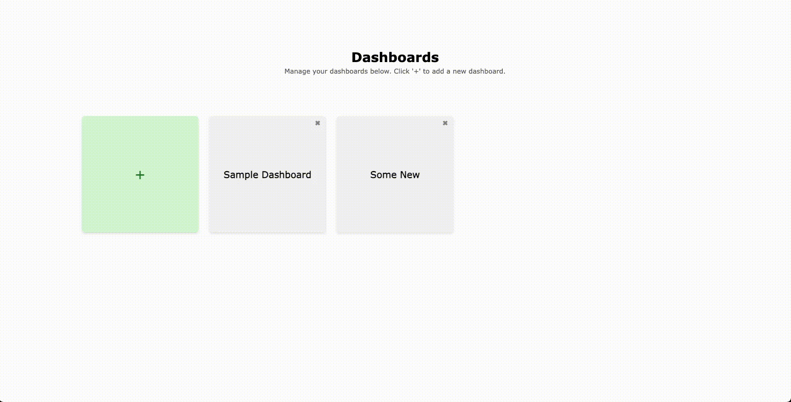

### BI-система на базе Elm
Этот проект представляет собой реализацию системы бизнес-аналитики (BI), созданной с использованием Elm для интерфейса.

### Структура проекта
Страницы приложения:
- `ListDashboards` - основная страница, на которой отображаются все дашборды
- `DashboardPage` - страница дашборда, на которой отображаются все графики

Компоненты:
- `AddDashboardForm` - форма для добавления нового дашборда
- `AddWidgetForm` - форма для добавления нового виджета на дашборд

Доступные графики на данный момент:

- `PieChart` - круговая диаграмма
- `BarChart` - столбчатая диаграмма

Построение графиков было реализовано на базе библиотеки [elm-visualization](https://package.elm-lang.org/packages/gampleman/elm-visualization/latest/).

### Пример работы

  

